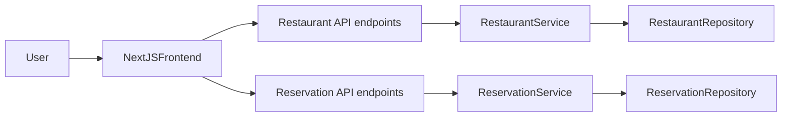

## Objetivos

- **Entender el backend actual**: endpoints y casos de uso de restaurantes y reservas, incluyendo modelo de permisos (cliente, dueño, admin).
- **Definir la arquitectura del frontend en Next.js**: estructura de rutas, páginas, componentes y servicios de API coherentes con el dominio.
- **Diseñar UX/UI a nivel de flujos y pantallas** para dos áreas: web pública de clientes y panel de administración/gestión.
- **Especificar integración con autenticación/autorización** aprovechando los roles y el modelo `AuthUser` existente en el backend.

## 1. Resumen del backend y dominio

- **Restaurantes** (`RestaurantService`, `RestaurantRepository` y adaptadores):
  - Alta de restaurante por un `owner` (`createRestaurant(request, ownerId)`), con datos de contacto, aforo (`size`), precio medio, tipo de cocina (`CuisineType`), opciones dietéticas (`DietaryOption`) y localización (`Location`).
  - **Lectura**:
    - `getRestaurantById(id)` – detalle de un restaurante.
    - `getAllRestaurants()` – listado completo.
    - `searchRestaurants(name, city, province, cuisineType, dietaryOption, maxPrice)` – búsqueda filtrada por nombre, ubicación, tipo de cocina, opciones dietéticas y precio máximo.
  - **Modificación y borrado**:
    - `updateRestaurant(id, request, requesterId)` – solo dueño o admin (`assertOwnerOrAdmin`).
    - `deleteRestaurant(id, requesterId)` – idem, controlado por rol.
- **Reservas** (`ReservationService`, `ReservationUseCase`, `ReservationController`):
  - **Crear reserva** (`POST /reservations`):
    - Recibe `CreateReservationRequest` con `restaurantId`, `startDate`, `partySize`, opcional `bookerEmail`.
    - Calcula `endDate` y verifica capacidad disponible en ese tramo horario con `sumPartySizeByRestaurantAndTimeRange` comparándolo con `restaurant.size`.
    - Crea `Reservation` con `status = PENDING`, `expiresAt` y `createdAt`.
  - **Consultar reservas del usuario** (`GET /reservations/my`):
    - Devuelve `Page<ReservationResponse>` filtrado por `userId` autenticado.
  - **Consultar reserva individual** (`GET /reservations/{id}`):
    - Requiere que la reserva pertenezca al usuario o que sea admin (`assertCanAccess`).
  - **Consultar reservas de restaurante** (`GET /reservations/restaurant/{restaurantId}`):
    - Solo para dueño del restaurante o admin (`assertRestaurantManager`).
  - **Confirmar / cancelar reserva** (`POST /reservations/{id}/confirm`, `/cancel`):
    - Control de permisos similar; al confirmar revisa expiración y cambia estado.
  - **Limpieza de reservas expiradas** (`expireStaleReservations`) para uso por un scheduler.
- **Seguridad y roles**:
  - Uso de `@AuthenticationPrincipal AuthUser` en controladores.
  - Roles globales (`GlobalRole.ADMIN`, usuario normal) y pertenencia a recursos (dueño de restaurante, propietario de reserva) usados en capa de aplicación para autorizar operaciones.

A partir de esto, el frontend debe:

- Mostrar **restaurantes** con filtros coherentes con `searchRestaurants`.
- Permitir **crear reservas** respetando slots horarios y capacidad, apoyándose en respuestas de la API (no en lógica en el cliente).
- Permitir a los usuarios ver y gestionar **sus reservas**.
- Dar al dueño/admin herramientas para gestionar **sus restaurantes** y ver/gestionar reservas del restaurante.

## 2. Arquitectura propuesta de frontend en Next.js

- **Stack base**:
  - Next.js con **app router**, TypeScript, React Server Components donde tenga sentido, y componentes cliente para formularios y UI interactiva.
  - Librería de UI recomendada: por ejemplo Tailwind CSS + componente de diseño (cards, modals, tablas) o un design system tipo MUI/Chakra (quedará como decisión de implementación).
  - Cliente HTTP: `fetch` encapsulado en **servicios de API** por dominio: `restaurantApi`, `reservationApi`, `authApi`.
- **Organización de carpetas (a alto nivel)**:
  - `app/`
    - `layout.tsx` – layout general con navbar, footer, proveedor de sesión/usuario.
    - `page.tsx` – landing o buscador de restaurantes por defecto.
    - `auth/` – páginas de login/registro (si se exponen por el frontend) o integración con SSO externo.
    - `restaurants/`
      - `page.tsx` – listado/buscador general.
      - `[id]/page.tsx` – detalle de restaurante + CTA para reservar.
    - `reservations/`
      - `my/page.tsx` – listado paginado de reservas del usuario.
      - `[id]/page.tsx` – detalle de una reserva.
    - `dashboard/`
      - `layout.tsx` – layout para área privada (dueño/admin).
      - `restaurants/`
        - `page.tsx` – listado de restaurantes del dueño.
        - `new/page.tsx` – formulario de creación.
        - `[id]/edit/page.tsx` – edición de restaurante.
        - `[id]/reservations/page.tsx` – reservas del restaurante con filtros/acciones (confirmar/cancelar).
  - `lib/api/` – funciones de acceso a la API REST (`getRestaurants`, `searchRestaurants`, `createReservation`, `confirmReservation`, etc.).
  - `components/` – componentes compartidos (formularios, tablas, filtros, inputs de fecha/hora, etc.).
- **Gestión de estado y datos**:
  - Datos de lectura frecuente (listas, detalles) gestionados con **React Query/TanStack Query** o `use` + `fetch` en componentes server.
  - Estado de usuario/autenticación almacenado mediante cookies/JWT enviado por el backend + wrapper en Next para hidratar `AuthUser` reducido en el cliente (id, email, rol, ownerRestaurantIds si lo expones).

## 3. Mapeo de endpoints a páginas y componentes

- **Área pública (clientes)**:
  - `GET /restaurants` (o equivalente) → página `restaurants/page.tsx` con:
    - **Filtros**: nombre, ciudad, provincia, tipo de cocina, opción dietética, precio máximo.
    - **Listado** de tarjetas de restaurante con nombre, cocina, precio medio, ciudad y botón “Ver detalle”.
  - `GET /restaurants/{id}` → `restaurants/[id]/page.tsx` con:
    - Datos completos del restaurante (contacto, ubicación, tamaño aproximado, opciones dietéticas, etc.).
    - Selector de fecha/hora y tamaño del grupo (`partySize`).
    - Botón “Reservar mesa” que abre un **formulario de reserva** (puede ser en la misma página o modal) que llama a `POST /reservations`.
  - `POST /reservations` → componente `ReservationForm`:
    - Campos: fecha/hora (`startDate`), `partySize`, email de contacto (pre-rellenado con el usuario autenticado, editable si deseas permitir otra persona de contacto), confirmación de restaurante.
    - Gestión de errores procedentes del backend (p.ej. `ReservationConflictException` traducida a mensajes como “No hay capacidad disponible en este horario para X personas”).
- **Área de usuario autenticado (cliente)**:
  - `GET /reservations/my` → `reservations/my/page.tsx`:
    - Lista paginada de reservas del usuario (`Page<ReservationResponse>`): se usarán `page` y `size` como query params.
    - Columnas típicas: restaurante, fecha/hora, número de personas, estado, acciones (ver, cancelar si procede).
  - `GET /reservations/{id}` → `reservations/[id]/page.tsx`:
    - Vista detalle de reserva con información del restaurante (nombre vía `restaurantName` en `ReservationResponse`) y acciones según estado.
  - `POST /reservations/{id}/cancel` → acción en la página detalle o en la tabla:
    - Botón “Cancelar” con confirmación modal; actualiza el estado a `CANCELLED` usando el endpoint.
- **Área privada – dashboard dueños/admins**:
  - `GET /restaurants` filtrado por owner (si existe endpoint, o desde el backend se limita por seguridad) → `dashboard/restaurants/page.tsx`:
    - Tabla con los restaurantes del dueño con acciones: editar, ver reservas, borrar.
  - `POST /restaurants` (o `createRestaurant`) → `dashboard/restaurants/new/page.tsx`:
    - Formulario de creación con todos los campos de `CreateRestaurantRequest` (nombre, email, teléfono, tamaño, precio medio, tipo cocina, opciones dietéticas, ubicación).
  - `PUT/PATCH /restaurants/{id}` (`updateRestaurant`) → `dashboard/restaurants/[id]/edit/page.tsx`:
    - Igual que el formulario de alta, con datos cargados desde `getRestaurantById`.
  - `DELETE /restaurants/{id}` → acción “Eliminar” en la tabla de restaurantes.
  - `GET /reservations/restaurant/{restaurantId}` → `dashboard/restaurants/[id]/reservations/page.tsx`:
    - Vista de **agenda/listado** de reservas del restaurante.
    - Filtros por estado (PENDING, CONFIRMED, etc.) y rango de fechas.
    - Acciones:
      - `POST /reservations/{id}/confirm` – botón “Confirmar”.
      - `POST /reservations/{id}/cancel` – botón “Cancelar”.

## 4. Flujo de autenticación y autorización en el frontend

- **Estado de sesión**:
  - El backend ya expone `AuthUser` en `@AuthenticationPrincipal`, por lo que el frontend debe:
    - Gestionar el login contra tu endpoint de autenticación actual (no visto aún, pero asumimos algo como `/auth/login`).
    - Almacenar token/cookie y, en SSR, extraer la identidad y roles para proteger rutas servidor.
  - En Next.js:
    - Middleware o layout que compruebe la sesión para rutas bajo `/reservations` y `/dashboard`.
    - Redirecciones a login si el usuario no está autenticado.
- **Autorización en UI**:
  - Hacer coincidir la lógica de permisos de backend con la UI:
    - Botones de “Confirmar/Cancelar” solo visibles si el usuario es owner/admin del restaurante (según los datos de usuario que exponga el backend) o titular de la reserva, respetando lo que ya controles del lado servidor.
    - Ocultar opciones de edición/borrado de restaurante a usuarios sin permisos.
  - Aun así, el backend mantiene la lógica real; el frontend solo mejora la UX.

## 5. Flujos clave de UX

- **Búsqueda y reserva rápida**:
  - Usuario entra a la home → ve buscador y listado de restaurantes recomendados.
  - Aplica filtros y selecciona un restaurante.
  - En el detalle elige fecha/hora y tamaño → envía reserva.
  - Tras la creación, redirigir a detalle de reserva o mostrar confirmación con opción de ir a “Mis reservas”.
- **Gestión de reservas para el cliente**:
  - Desde el menú de usuario, acceso a “Mis reservas”.
  - Tabla paginada con estados y acciones de cancelación rápida, con feedback inmediato.
- **Gestión de restaurante para dueño/admin**:
  - Acceso a dashboard → listado de restaurantes del usuario.
  - Desde cada restaurante: edición de datos básicos y acceso a “Reservas”, con vista tipo agenda/lista con acciones de confirmación/cancelación.

## 6. Diagrama de alto nivel (backend–frontend)

## 7. Próximos pasos tras aprobar el plan

- **Concretar la estructura de rutas en Next.js** con ejemplos de archivos y firmas de funciones `fetch` para cada endpoint relevante.
- **Definir contratos de tipos TypeScript** basados en tus DTOs (`RestaurantResponse`, `ReservationResponse`, `CreateRestaurantRequest`, `CreateReservationRequest`).
- **Bajar al detalle de los componentes principales** (props, estados y eventos) para las pantallas clave: buscador de restaurantes, detalle, formulario de reserva, mis reservas, dashboard de restaurantes y reservas.
- (Opcional) **Proponer un diseño visual base** (paleta, layout) y una librería de componentes concreta para acelerar el desarrollo.

