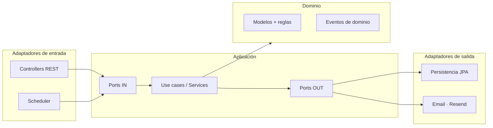
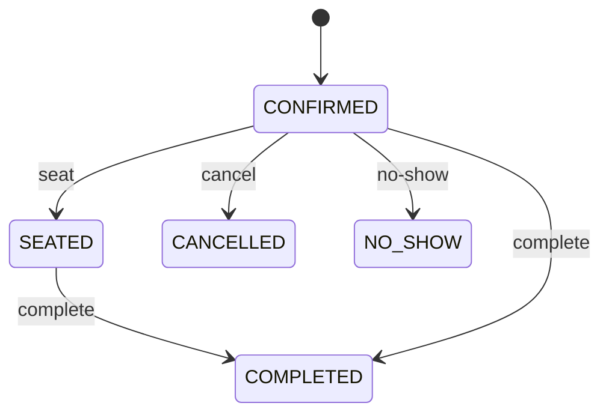
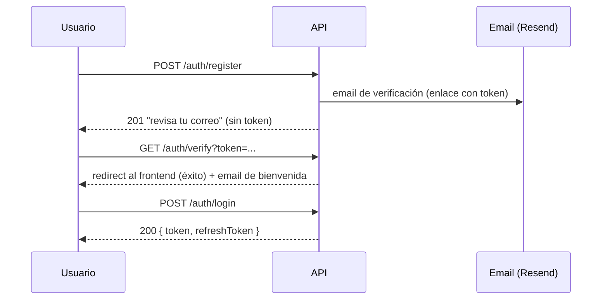

# Restaurant API

> Plataforma de búsqueda y reserva de restaurantes para España.

API REST construida con **Spring Boot 3.3** y **Java 21**, siguiendo una **arquitectura hexagonal** (puertos y adaptadores). Cubre la gestión de restaurantes, su plano de mesas, un motor de reservas con asignación automática de mesa, cartas/menús y un sistema de notificaciones por email.


---

## Tabla de contenidos

1. [Características](#características)
2. [Stack tecnológico](#stack-tecnológico)
3. [Arquitectura](#arquitectura)
4. [Requisitos previos](#requisitos-previos)
5. [Configuración](#configuración)
6. [Cómo arrancar](#cómo-arrancar)
7. [Conceptos de dominio](#conceptos-de-dominio)
8. [Autenticación y seguridad](#autenticación-y-seguridad)
9. [Notificaciones por email](#notificaciones-por-email)
10. [Referencia de la API](#referencia-de-la-api)
11. [Testing](#testing)
12. [Estructura del proyecto](#estructura-del-proyecto)

---

## Características

- **Restaurantes**: alta, edición, borrado y **búsqueda con filtros** (nombre, ciudad, provincia, tipo de cocina, opción dietética, precio máximo).
- **Plano de mesas (floor-plan)**: cada restaurante define sus mesas (capacidad, forma, posición x/y, zona) y consulta el estado de ocupación en cualquier instante.
- **Motor de reservas**:
  - Asignación automática de mesa por **best-fit** (la mesa libre más pequeña que encaje).
  - **Buffer de limpieza** configurable entre reservas de una misma mesa.
  - **Deduplicación** de doble-click / reenvíos accidentales.
  - Ciclo de vida de estados (`CONFIRMED → SEATED → COMPLETED`, `CANCELLED`, `NO_SHOW`).
- **Cartas / menús**: menú por restaurante, con categorías e ítems (nombre, descripción, precio, disponibilidad).
- **Autenticación**: registro con **verificación de email obligatoria**, login con JWT, login con **Google OAuth**, y roles (`USER`, `OWNER`, `ADMIN`).
- **Notificaciones por email** (vía Resend): verificación de cuenta, bienvenida, confirmación y cancelación de reserva, y **recordatorio 24 h antes** mediante una tarea programada.

---

## Stack tecnológico

| Área | Tecnología |
|---|---|
| Lenguaje | Java 21 |
| Framework | Spring Boot 3.3 (Web, Data JPA, Security, Validation) |
| Persistencia | MySQL 8 + Hibernate/JPA |
| Autenticación | Spring Security, JWT (jjwt), OAuth2 Resource Server (Google JWK) |
| Email | [Resend](https://resend.com) (`resend-java`) |
| Utilidades | Lombok, MapStruct |
| Build | Maven |
| Pruebas | JUnit 5, Mockito, Spring Security Test |

---

## Arquitectura

El proyecto sigue una **arquitectura hexagonal (puertos y adaptadores)** con tres capas y una **regla de dependencias estricta**: el dominio no depende de nada; la aplicación depende del dominio; la infraestructura depende de ambos.



**Estructura de paquetes** (`com.restaurant`):

```
domain/            # Modelos, reglas de negocio, eventos, excepciones, interfaces de repositorio
  model/  event/  repository/  valueobject/  exception/
application/       # Casos de uso y contratos
  port/in/         #   puertos de entrada (lo que la API ofrece)
  port/out/        #   puertos de salida (lo que la app necesita: email, ...)
  usecase/         #   implementación de los casos de uso
  listener/        #   listeners de eventos de dominio
  dto/             #   request/response
infrastructure/    # Detalles técnicos (adaptadores)
  web/             #   controllers + manejo de errores
  persistence/     #   entidades JPA, repos Spring Data, mappers y adaptadores
  security/        #   JWT, filtros, Google OAuth, configuración de seguridad
  email/           #   adaptador Resend + plantillas
  scheduler/       #   tareas @Scheduled
  config/          #   configuración transversal
```

> Hay una nota de arquitectura del frontend en [`frontend/ARCHITECTURE.md`](frontend/ARCHITECTURE.md).

---

## Requisitos previos

- **JDK 21**
- **Maven 3.9+** (o el wrapper, si se añade)
- **MySQL 8** en marcha
- Una **API key de [Resend](https://resend.com)** para el envío de emails (opcional en local: si no se configura, los envíos fallan y solo se registran en el log, sin romper el flujo).

---

## Configuración

La configuración usa **perfiles de Spring**. El perfil activo se controla con `SPRING_PROFILES_ACTIVE` (por defecto `dev`):

- `application-dev.yml` — desarrollo. `ddl-auto: update`, valores por defecto locales.
- `application-prod.yml` — producción. `ddl-auto: validate`, **todo se inyecta por variables de entorno** (sin defaults sensibles).

El servidor escucha en el puerto **8080** con context-path **`/api/v1`**, por lo que la URL base es:

```
http://localhost:8080/api/v1
```

### Variables de entorno

| Variable | Descripción | Default (dev) |
|---|---|---|
| `SPRING_PROFILES_ACTIVE` | Perfil activo (`dev` / `prod`) | `dev` |
| `DB_URL` | URL JDBC de MySQL (solo prod) | `jdbc:mysql://localhost:33066/prueba` (dev) |
| `DB_USERNAME` | Usuario de BD | `sql` |
| `DB_PASSWORD` | Contraseña de BD | `sql111` |
| `JWT_SECRET` | Secreto HMAC para firmar los JWT | *(default solo en dev)* |
| `RESEND_API_KEY` | API key de Resend | *(default solo en dev)* |
| `MAIL_FROM` | Remitente de los emails | `Restaurant <onboarding@resend.dev>` |
| `GOOGLE_CLIENT_ID` | Client ID de Google OAuth | *(default solo en dev)* |
| `GOOGLE_JWK_SET_URI` | JWK set de Google | `https://www.googleapis.com/oauth2/v3/certs` |
| `RESERVATION_TURNOVER_BUFFER` | Minutos de limpieza entre reservas de una mesa | `30` |
| `RESERVATION_DEDUP_WINDOW` | Ventana (s) de deduplicación de reservas | `10` |
| `REMINDER_LEAD_TIME_HOURS` | Antelación (h) del recordatorio de reserva | `24` |
| `REMINDER_CRON` | Frecuencia del job de recordatorios (cron Spring) | `0 */15 * * * *` |
| `VERIFICATION_TTL_HOURS` | Validez del enlace de verificación | `24` |
| `VERIFY_BASE_URL` | URL pública del endpoint `GET /auth/verify` | `http://localhost:8080/api/v1/auth/verify` |
| `FRONTEND_EMAIL_VERIFIED_URL` | Página de éxito tras verificar | `http://localhost:3000/email-verificado` |
| `FRONTEND_EMAIL_VERIFY_ERROR_URL` | Página de error de verificación | `http://localhost:3000/email-error` |

> ⚠️ El `application-dev.yml` incluye valores por defecto (secreto JWT, API key) **solo para desarrollo local**. Nunca uses esos valores en producción y no publiques claves reales en el repositorio.

---

## Cómo arrancar

```bash
# 1. Clonar
git clone <repo-url>
cd restaurant-api

# 2. Levantar MySQL (ejemplo con Docker, puerto 33066 como en dev)
docker run --name restaurant-mysql -e MYSQL_ROOT_PASSWORD=root \
  -e MYSQL_DATABASE=prueba -e MYSQL_USER=sql -e MYSQL_PASSWORD=sql111 \
  -p 33066:3306 -d mysql:8

# 3. (Opcional) configurar el envío real de emails
export RESEND_API_KEY=re_tu_clave

# 4. Arrancar la aplicación
mvn spring-boot:run
```

La API quedará disponible en `http://localhost:8080/api/v1`. En el perfil `dev`, Hibernate crea/actualiza el esquema automáticamente (`ddl-auto: update`).

---

## Conceptos de dominio

### Roles

- **Rol global** (`globalRole`): `USER` o `ADMIN`.
- **Rol de restaurante** (`restaurantRole`): `OWNER` / `WORKER` (se asigna al registrar un propietario o gestionar su personal).

### Ciclo de vida de una reserva

Una reserva nace `CONFIRMED` con la mesa ya asignada. El propietario gestiona las transiciones:



### Asignación de mesa

Al crear una reserva, el sistema bloquea el restaurante (lock pesimista para serializar la asignación) y elige la **mesa libre más pequeña que encaje** con el número de comensales (best-fit), descartando las ocupadas dentro de la ventana de la reserva ampliada por el **buffer de limpieza**. El cliente nunca elige ni ve la mesa; el propietario puede reasignarla después.

---

## Autenticación y seguridad

El registro **no hace auto-login**: el login queda **bloqueado hasta que el email está verificado**.



- **JWT**: el login devuelve un `token` (24 h) y un `refreshToken` (7 días). Se envían en la cabecera `Authorization: Bearer <token>`.
- **Google OAuth**: `POST /auth/google` con el `idToken`. Las cuentas de Google se crean ya verificadas.
- **Login bloqueado**: si el email no está verificado, el login responde **403**.

### Matriz de autorización (resumen)

| Recurso | Acceso |
|---|---|
| `/auth/**` | Público |
| `GET /restaurants/**`, `GET /menus/**` | Público |
| `POST/PUT/DELETE /restaurants/**` | `USER`/`OWNER`/`ADMIN` según operación |
| `/restaurants/{id}/tables/**`, `/floor-plan/**` | `OWNER` / `ADMIN` |
| Escritura de menús, reservas | Autenticado (propiedad verificada en el caso de uso) |
| `/admin/**` | `ADMIN` |

---

## Notificaciones por email

El envío es un **puerto de salida** (`application/port/out/EmailNotificationPort`) implementado por un adaptador de **Resend** (`infrastructure/email`). Características clave:

- **Asíncrono y a prueba de fallos**: un fallo de envío se registra en el log pero **nunca rompe** la operación de negocio.
- **Patrón `AFTER_COMMIT`**: los emails ligados a una transacción (crear/cancelar reserva, recordatorio) se disparan mediante **eventos de dominio** que el listener procesa solo **después** de que la transacción confirme. Si hay rollback, no se envía nada.

| Caso | Disparador |
|---|---|
| Verificación de cuenta | Al registrarse |
| Bienvenida | Al verificar el email con éxito |
| Confirmación de reserva | Al crear la reserva (evento `AFTER_COMMIT`) |
| Cancelación de reserva | Al cancelar (evento `AFTER_COMMIT`) |
| Recordatorio 24 h | Job `@Scheduled` (idempotente vía flag `reminderSent`) |

El **recordatorio** lo dispara un scheduler (`infrastructure/scheduler`) que busca reservas `CONFIRMED` que empiezan dentro de la antelación configurada y aún no han sido recordadas. El flag `reminderSent` lo hace idempotente y tolerante a caídas.

---

## Referencia de la API

URL base: `http://localhost:8080/api/v1`. Para detalle de cuerpos y un flujo de prueba completo, ver la **colección de Postman** y su guía:

- [`postman/restaurant-api.postman_collection.json`](postman/restaurant-api.postman_collection.json)
- [`postman/TESTING_GUIDE.md`](postman/TESTING_GUIDE.md)

### Auth — `/auth` (público)

| Método | Ruta | Descripción |
|---|---|---|
| POST | `/auth/register` | Registro de usuario común (queda sin verificar). |
| POST | `/auth/register/owner` | Registro de propietario + restaurante (atómico). |
| POST | `/auth/login` | Login con email/contraseña → JWT. **403 si no verificado.** |
| POST | `/auth/google` | Login con Google (`idToken`). |
| POST | `/auth/refresh` | Renueva el token a partir del `refreshToken`. |
| GET | `/auth/verify?token=` | Verifica el email y redirige al frontend. |
| POST | `/auth/resend-verification` | Reenvía el email de verificación. |

### Restaurantes — `/restaurants`

| Método | Ruta | Auth |
|---|---|---|
| POST | `/restaurants` | USER/ADMIN |
| GET | `/restaurants` | público |
| GET | `/restaurants/{id}` | público |
| GET | `/restaurants/search?name=&city=&province=&cuisineType=&dietaryOption=&maxPrice=` | público |
| PUT | `/restaurants/{id}` | OWNER/ADMIN |
| DELETE | `/restaurants/{id}` | OWNER/ADMIN |

### Mesas — `/restaurants/{restaurantId}/tables` (OWNER/ADMIN)

| Método | Ruta |
|---|---|
| POST | `/restaurants/{restaurantId}/tables` |
| GET | `/restaurants/{restaurantId}/tables` |
| GET | `/restaurants/{restaurantId}/tables/{tableId}` |
| PUT | `/restaurants/{restaurantId}/tables/{tableId}` |
| DELETE | `/restaurants/{restaurantId}/tables/{tableId}` (soft-delete) |

### Floor-plan — `/restaurants/{restaurantId}/floor-plan` (OWNER/ADMIN)

| Método | Ruta | Notas |
|---|---|---|
| GET | `/restaurants/{restaurantId}/floor-plan?at=YYYY-MM-DDTHH:mm` | Estado de cada mesa en ese instante (sin `at` = ahora). |

### Reservas — `/reservations` (autenticado)

| Método | Ruta | Auth |
|---|---|---|
| POST | `/reservations` | cliente |
| GET | `/reservations/{id}` | dueño/admin |
| GET | `/reservations/my?page=&size=` | cliente |
| GET | `/reservations/restaurant/{restaurantId}` | owner/admin |
| POST | `/reservations/{id}/cancel` | dueño/admin |
| PATCH | `/reservations/{id}/assign-table` | owner/admin |
| PATCH | `/reservations/{id}/seat` | owner/admin |
| PATCH | `/reservations/{id}/complete` | owner/admin |
| PATCH | `/reservations/{id}/no-show` | owner/admin |

### Menús — `/menus`

| Método | Ruta | Auth |
|---|---|---|
| POST | `/menus/restaurant/{restaurantId}` | owner/admin |
| GET | `/menus/restaurant/{restaurantId}` | público |
| POST | `/menus/categories` | owner/admin |
| POST | `/menus/items` | owner/admin |
| DELETE | `/menus/items/{itemId}` | owner/admin |
| DELETE | `/menus/categories/{categoryId}` | owner/admin |

---

## Testing

```bash
# Tests unitarios (JUnit 5 + Mockito)
mvn test
```

Para pruebas de integración manuales (flujo extremo a extremo), importa la colección de Postman y sigue [`postman/TESTING_GUIDE.md`](postman/TESTING_GUIDE.md), que incluye escenarios con aserciones automáticas (best-fit, conflicto de aforo, deduplicación).

---

## Estructura del proyecto

```
restaurant-api/
├── src/main/java/com/restaurant/
│   ├── domain/            # modelos, eventos, repos (interfaces), excepciones
│   ├── application/       # casos de uso, puertos in/out, listeners, DTOs
│   └── infrastructure/    # web, persistencia, seguridad, email, scheduler, config
├── src/main/resources/    # application.yml + perfiles dev/prod
├── src/test/              # tests unitarios
├── postman/               # colección + guía de pruebas
├── frontend/              # documentación de arquitectura del frontend
└── pom.xml
```
